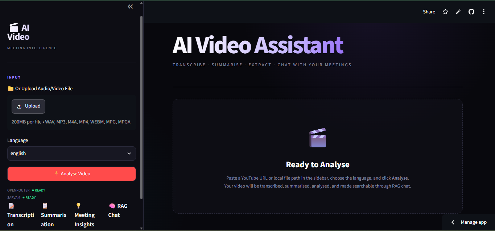
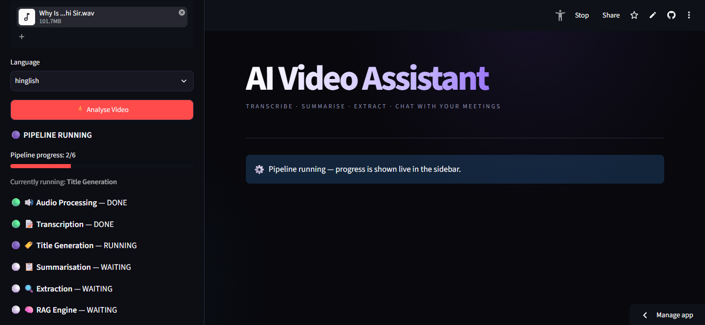
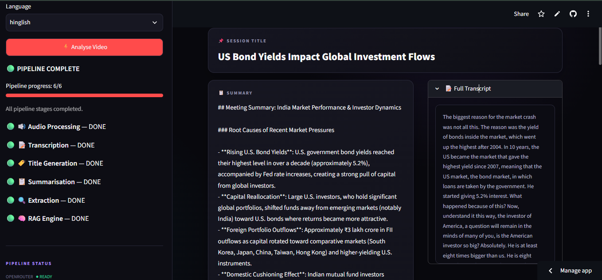
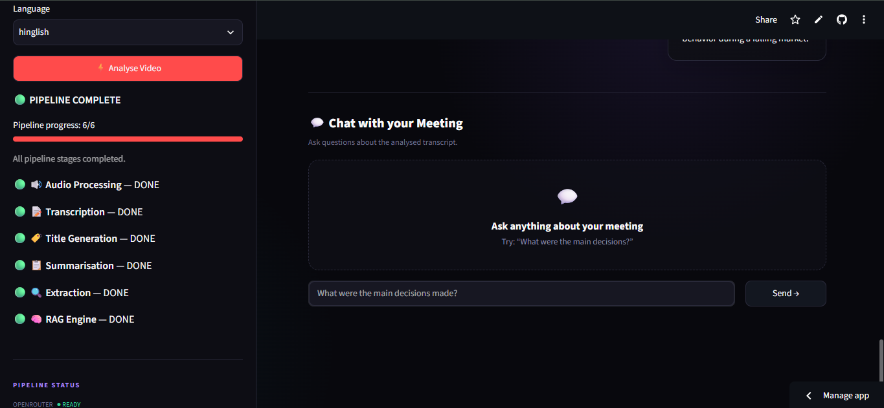

# 🎥 AI Video & Audio Analysis Agent

  <h3>AI-Powered Video & Audio Analysis using Whisper, LLMs and RAG</h3>

  Transform audio and video recordings into transcripts, summaries,
  action items, key decisions, open questions, and context-aware answers.

## 🚀 Live Demo

🔗 **Try the AI Video & Audio Analysis Agent:**  
[**Launch Live Application →**](https://video-agent-pesvdsxen34jeyispbg6gi.streamlit.app/)

> Upload an audio/video file and experience the complete AI-powered
> transcription, summarization, information extraction, and RAG-based
> question-answering pipeline directly in your browser.

---

## 📸 Application Preview

### 🏠 Main Interface

> Upload an audio or video file and select the required language.

### ⚙️ Processing Pipeline

> The application displays the progress of the audio processing, transcription, and AI analysis pipeline.

### 📊 Analysis Results

> View the generated transcript, summary, action items, key decisions, and open questions.

### 💬 RAG-Based Question Answering

> Ask questions about the uploaded recording and receive context-aware answers based on the transcript.

---

## 📌 Overview

The **AI Video & Audio Analysis Agent** is an AI-powered application that converts uploaded audio and video files into structured and meaningful information.

The application combines **Speech-to-Text, Large Language Models (LLMs), Natural Language Processing, Vector Embeddings, Retrieval-Augmented Generation (RAG), and Semantic Search** into a single easy-to-use Streamlit application.

Instead of manually watching or listening to a long recording, users can upload the file and automatically obtain:

- 📝 Full Transcript
- 📄 AI-Generated Summary
- 📌 Action Items
- ✅ Key Decisions
- ❓ Open Questions
- 💬 Context-Aware Question Answering

---

## ✨ Features

### 🎥 Audio & Video File Upload

Upload audio and video files directly through the web interface.

**Supported formats:**

- `.wav`
- `.mp3`
- `.m4a`
- `.mp4`
- `.webm`
- `.mpeg`
- `.mpga`

### 📝 Automatic Speech-to-Text

The application uses **OpenAI Whisper** to convert spoken audio into text.

Before transcription, the uploaded media is:

1. Converted into WAV format
2. Converted to mono audio
3. Resampled to 16 kHz
4. Divided into smaller chunks
5. Transcribed using Whisper

### 🌐 Language Support

The application currently provides:

- 🇬🇧 English
- 🇮🇳 Hinglish

The architecture can be extended for additional multilingual speech-processing workflows.

### 🧠 AI-Powered Summarization

The generated transcript is processed by an LLM to create a concise and meaningful summary of the uploaded recording.

### 📌 Action Item Extraction

Automatically identifies tasks, responsibilities, and follow-up activities discussed in the recording.

### ✅ Key Decision Extraction

Extracts important decisions and conclusions discussed during the recording.

### ❓ Open Question Detection

Identifies questions, unresolved issues, and topics that require further discussion.

### 🔎 RAG-Based Question Answering

Users can ask questions about the uploaded recording.

The system retrieves relevant transcript sections using vector similarity search and provides them as context to the language model before generating an answer.

### 📊 Live Processing Status

The application displays the progress of different stages of the AI pipeline while processing the uploaded media.

---

## 🚀 System Workflow

The complete processing workflow is:

    ┌─────────────────────────┐
    │   Upload Audio/Video   │
    └────────────┬────────────┘
                 │
                 ▼
    ┌─────────────────────────┐
    │    Audio Processing     │
    │  Convert / Normalize    │
    └────────────┬────────────┘
                 │
                 ▼
    ┌─────────────────────────┐
    │     Audio Chunking      │
    └────────────┬────────────┘
                 │
                 ▼
    ┌─────────────────────────┐
    │   Whisper Transcription │
    └────────────┬────────────┘
                 │
                 ▼
    ┌─────────────────────────┐
    │       Transcript        │
    └────────────┬────────────┘
                 │
          ┌──────┼───────┐
          │      │       │
          ▼      ▼       ▼
       Summary Actions Decisions
          │      │       │
          └──────┼───────┘
                 │
                 ▼
    ┌─────────────────────────┐
    │     Open Questions      │
    └────────────┬────────────┘
                 │
                 ▼
    ┌─────────────────────────┐
    │    Vector Embeddings    │
    └────────────┬────────────┘
                 │
                 ▼
    ┌─────────────────────────┐
    │       ChromaDB          │
    │     Vector Storage      │
    └────────────┬────────────┘
                 │
                 ▼
    ┌─────────────────────────┐
    │      RAG Pipeline       │
    └────────────┬────────────┘
                 │
                 ▼
    ┌─────────────────────────┐
    │   Context-Aware Q&A     │
    └─────────────────────────┘

---

## 🧩 How the Application Works

### 1. 📂 Media Upload

The user uploads an audio or video file through the Streamlit interface.

The uploaded file is temporarily stored in the `downloads` directory for processing.

### 2. 🎵 Audio Conversion

The uploaded media is converted into a standardized WAV audio file.

The processing pipeline converts the audio to:

- Mono audio
- 16 kHz sample rate
- WAV format

This provides a consistent input format for the transcription stage.

### 3. ✂️ Audio Chunking

Long recordings are divided into smaller chunks before transcription.

    Long Audio
        ↓
    Chunk 1
    Chunk 2
    Chunk 3
        ↓
       ...
        ↓
    Chunk N

Each chunk is processed individually.

### 4. 📝 Speech Recognition

Each audio chunk is passed to Whisper.

    Audio Chunk
         ↓
       Whisper
         ↓
        Text

The individual transcript segments are combined to produce the final transcript.

### 5. 🧠 AI Analysis

The generated transcript is passed through multiple AI-powered operations.

    Transcript
         │
         ├── Title Generation
         │
         ├── Summary Generation
         │
         ├── Action Item Extraction
         │
         ├── Key Decision Extraction
         │
         └── Open Question Extraction

This transforms unstructured speech into structured information.

### 6. 🔢 Vector Embeddings

The transcript is divided into meaningful text chunks.

Each chunk is converted into a numerical vector representation using HuggingFace embeddings.

    Transcript
         ↓
    Text Chunks
         ↓
    Embeddings
         ↓
    Vector Database

### 7. 🔎 RAG Question Answering

When a user asks a question, the system performs the following process:

    User Question
         ↓
    Query Embedding
         ↓
    Similarity Search
         ↓
    Relevant Transcript Chunks
         ↓
    LLM Context
         ↓
    Generated Answer

This allows the application to answer questions specifically based on the uploaded recording.

---

## 🛠️ Technology Stack

| Category | Technology |
|---|---|
| Programming Language | Python |
| User Interface | Streamlit |
| Speech-to-Text | OpenAI Whisper |
| Large Language Model | OpenRouter |
| AI Framework | LangChain |
| Vector Database | ChromaDB |
| Embeddings | HuggingFace Sentence Transformers |
| Audio Processing | PyDub |
| Media Conversion | FFmpeg |
| Environment Variables | python-dotenv |
| Deployment | Streamlit Community Cloud |

---

## 📁 Project Structure

    video-agent/
    │
    ├── core/
    │   ├── extractor.py
    │   ├── rag_engine.py
    │   ├── sammarize.py
    │   ├── transcriber.py
    │   └── vector_store.py
    │
    ├── utlis/
    │   └── audio_processor.py
    │
    ├── downloads/
    │
    ├── vector_db/
    │
    ├── assets/
    │   └── ui-screenshot.png
    │
    ├── app.py
    ├── main.py
    ├── requirements.txt
    ├── packages.txt
    ├── .env.example
    ├── .gitignore
    └── README.md

---

## 📂 Supported File Formats

The application currently supports:

- WAV
- MP3
- M4A
- MP4
- WEBM
- MPEG
- MPGA

---

## ⚙️ Installation

### 1. Clone the Repository

    git clone https://github.com/YOUR_USERNAME/YOUR_REPOSITORY.git
    cd video-agent

Replace `YOUR_USERNAME/YOUR_REPOSITORY` with your actual GitHub repository.

### 2. Create a Virtual Environment

    python -m venv .venv

### 3. Activate the Virtual Environment

**Windows:**

    .venv\Scripts\activate

**Linux / macOS:**

    source .venv/bin/activate

### 4. Install Dependencies

    pip install -r requirements.txt

---

## 🔐 Environment Configuration

Create a `.env` file in the root directory.

    OPENROUTER_API_KEY=your_openrouter_api_key
    SARVAM_API_KEY=your_sarvam_api_key

    WHISPER_MODEL=small
    SARVAM_STT_MODEL=saaras:v2.5

### ⚠️ Security Notice

Never commit your `.env` file to GitHub.

API keys should always be stored securely using environment variables or Streamlit Secrets.

The `.env.example` file can be used as a template:

    OPENROUTER_API_KEY=
    SARVAM_API_KEY=

    WHISPER_MODEL=small
    SARVAM_STT_MODEL=saaras:v2.5

---

## ▶️ Running the Application

After activating the virtual environment, start the Streamlit application:

    streamlit run app.py

Streamlit will provide a local URL that can be opened in your browser.

---

## 🖥️ How to Use

### Step 1 — Upload a File

Upload an audio or video file using the file uploader.

### Step 2 — Select Language

Choose the appropriate language option:

- English
- Hinglish

### Step 3 — Start Analysis

Run the analysis pipeline.

The application will process the uploaded recording through the complete AI pipeline.

### Step 4 — Explore Results

After processing, the application provides:

- 🎯 Generated Title
- 📝 Full Transcript
- 📄 Summary
- 📌 Action Items
- ✅ Key Decisions
- ❓ Open Questions
- 💬 RAG-Based Question Answering

---

## 🌐 Deployment

The application can be deployed using **Streamlit Community Cloud**.

### Deployment Workflow

    GitHub Repository
           │
           ▼
    Streamlit Community Cloud
           │
           ▼
    Configure Application Secrets
           │
           ▼
    Deploy Application
           │
           ▼
    Public Web Application

For cloud deployment, configure the required API keys through Streamlit Secrets instead of committing them to the repository.

Example:

    OPENROUTER_API_KEY = "your_openrouter_api_key"
    SARVAM_API_KEY = "your_sarvam_api_key"

---

## 🔒 Security Considerations

The application may process potentially sensitive audio and video recordings.

Recommended security practices:

- Never expose API keys in source code.
- Never commit `.env` files.
- Use Streamlit Secrets for cloud deployment.
- Avoid uploading confidential recordings to untrusted environments.
- Protect access to the deployed application when handling sensitive data.
- Consider deleting temporary uploaded files after processing.
- Keep dependencies updated.

---

## ⚠️ Current Limitations

### Audio Quality

Background noise, low-quality microphones, overlapping speakers, and unclear speech may reduce transcription accuracy.

### Mixed-Language Speech

Natural Hindi-English mixed speech can be more challenging than single-language speech and may require additional language-aware processing.

### Processing Time

Large audio/video files may require significant processing time and computational resources.

### AI-Generated Results

Summaries, action items, decisions, questions, and generated answers are AI-generated and may occasionally contain inaccuracies.

### Hardware Requirements

Whisper and embedding models can require considerable CPU/GPU resources, particularly for large recordings.

---

## 🔮 Future Enhancements

Potential future improvements include:

- 🎙️ Improved Hindi-English mixed-language transcription
- 👤 Speaker identification
- 🗣️ Speaker diarization
- ⏱️ Timestamp-based transcript navigation
- 📄 PDF report generation
- 📥 Transcript export
- 📄 DOCX export
- 📝 TXT export
- 🗂️ Multiple-document knowledge base
- 💬 Improved conversational memory
- 📊 Analytics dashboard
- ⚡ Optimized and faster transcription
- 🔐 Enhanced privacy controls
- 🌍 Additional language support
- 📱 Improved responsive UI

---

## 🎯 Use Cases

### 🎓 Education

- Online lectures
- Classroom recordings
- Seminars
- Tutorials
- Study material generation

### 💼 Business

- Business meetings
- Meeting summaries
- Action-item extraction
- Decision tracking
- Project discussions

### 🧑‍💻 Technical Discussions

- Software development meetings
- Technical presentations
- Project discussions
- Requirement analysis
- Team discussions

### 📢 Seminars & Webinars

- Webinar transcription
- Seminar summaries
- Important-point extraction
- Content-based question answering

### 📝 Interviews

- Interview transcription
- Discussion analysis
- Key-point extraction
- Question identification

### 📚 Research

- Research discussions
- Academic lectures
- Recorded meetings
- Research interviews
- Information retrieval from long recordings

---

## 📌 Example Workflow

    Upload Recording
          │
          ▼
    Process Audio/Video
          │
          ▼
    Convert Audio
          │
          ▼
    Split into Chunks
          │
          ▼
    Generate Transcript
          │
          ├──────────────┬──────────────┐
          ▼              ▼              ▼
       Summary        Actions       Decisions
          │              │              │
          └──────────────┼──────────────┘
                         ▼
                  Open Questions
                         │
                         ▼
                  Create Vector Store
                         │
                         ▼
                  Ask a Question
                         │
                         ▼
                  Retrieve Context
                         │
                         ▼
                  Generate Answer

---

## 🧪 Example Output

For a recorded meeting, the application can transform raw speech into structured information such as:

    Title:
    Project Planning Meeting

    Summary:
    The team discussed upcoming project milestones, development tasks,
    and the expected delivery timeline.

    Action Items:
    • Complete project documentation
    • Review the development module
    • Prepare the testing report

    Key Decisions:
    • The project will follow the proposed development timeline.

    Open Questions:
    • What is the final deployment date?
    • Who will handle the testing phase?

The actual output depends on the content of the uploaded recording.

---

## 📈 Project Highlights

This project demonstrates the integration of multiple modern AI technologies into a single practical application.

    Audio / Video
          │
          ▼
    Audio Processing
          │
          ▼
    Whisper Speech-to-Text
          │
          ▼
    Transcript
          │
       ┌──┼────────┐
       ▼  ▼        ▼
    Summary Actions Decisions
       │  │        │
       └──┼────────┘
          ▼
    Open Questions
          │
          ▼
    Text Embeddings
          │
          ▼
       ChromaDB
          │
          ▼
          RAG
          │
          ▼
    Context-Aware Q&A

---

## 🤝 Contributing

Contributions, suggestions, and improvements are welcome.

### 1. Fork the repository

### 2. Create a feature branch

    git checkout -b feature/new-feature

### 3. Make your changes

### 4. Commit your changes

    git add .
    git commit -m "Add new feature"

### 5. Push the branch

    git push origin feature/new-feature

### 6. Open a Pull Request

---

## 📄 License

This project is intended for educational, research, and demonstration purposes.

If you plan to distribute the project publicly, add an appropriate open-source license such as the MIT License.

---

## 👨‍💻 Author

**Vishal Kumar**

Python • Artificial Intelligence • Generative AI • Machine Learning • RAG

---

## ⭐ Support

If you find this project useful, consider giving the repository a ⭐ on GitHub.

---

  Made with ❤️ using Python, Streamlit and AI

